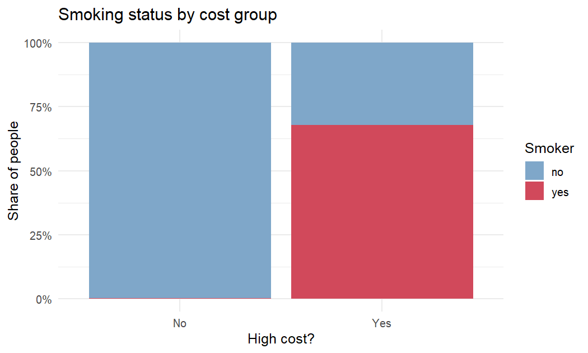
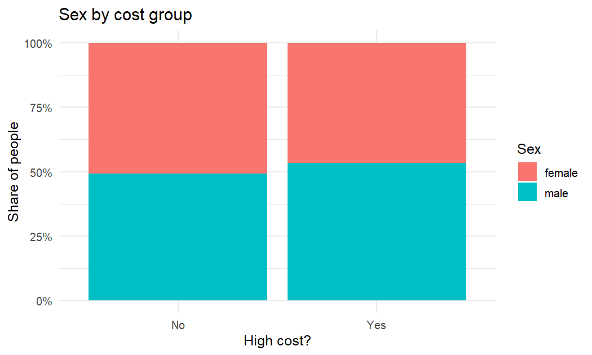
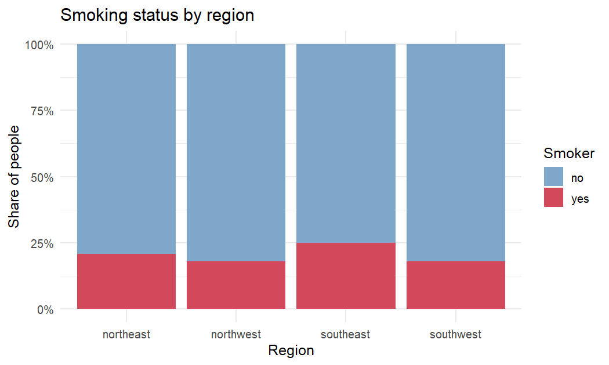
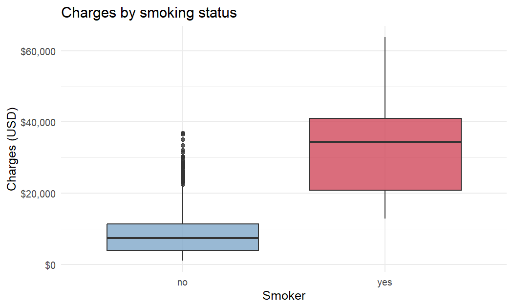
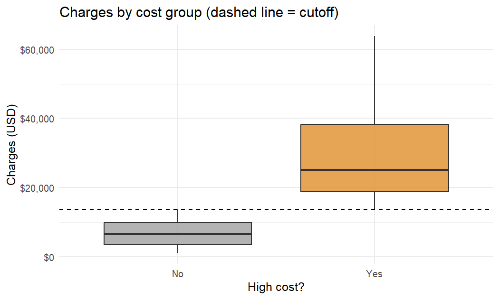
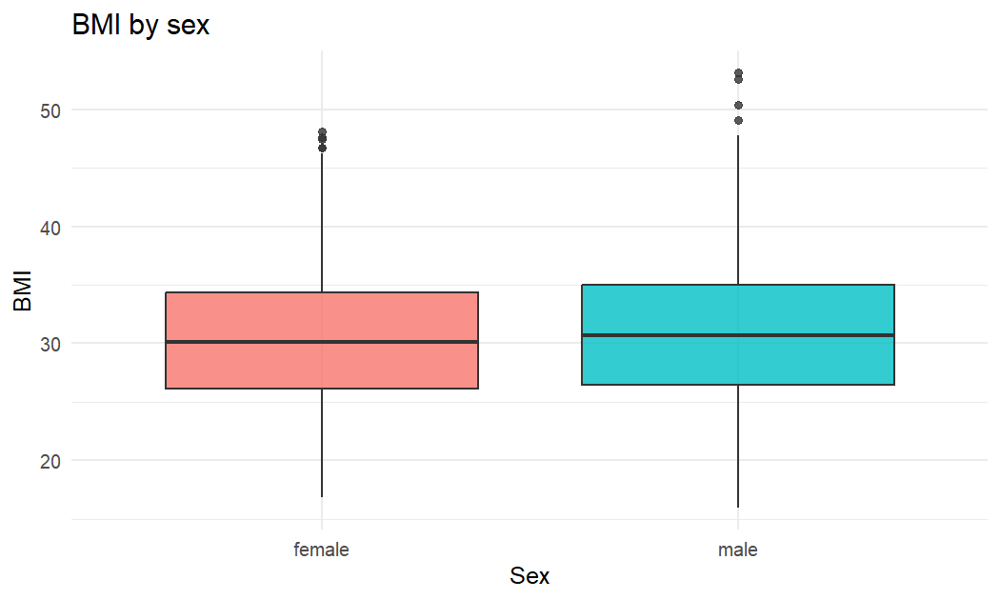
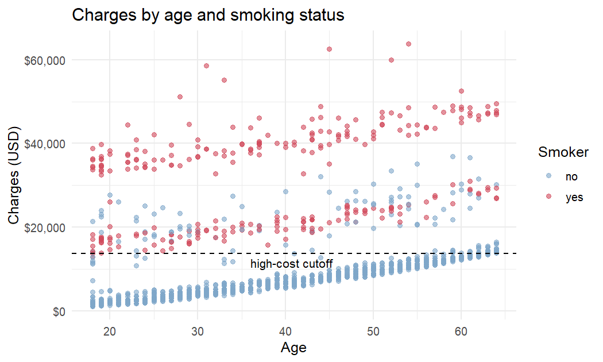
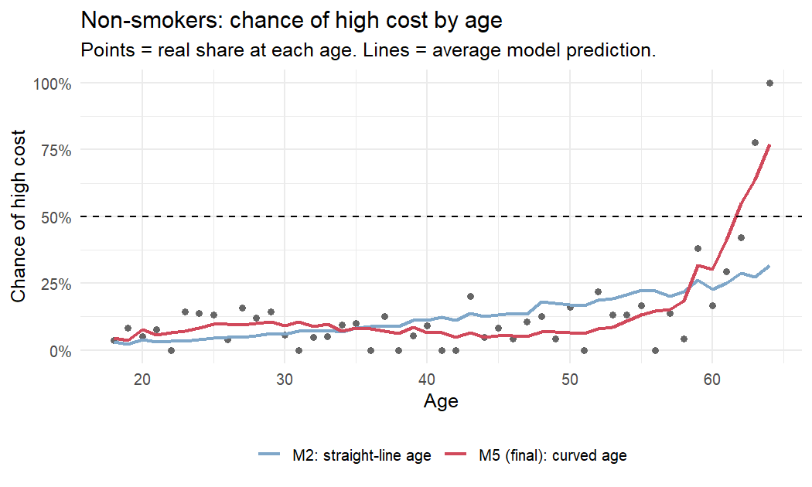
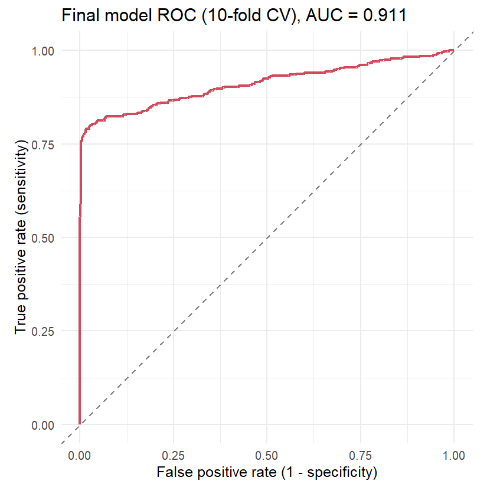

Medical Insurance: Who Becomes a High-Cost Patient?
================

- [1. Goal](#1-goal)
- [2. Data](#2-data)
- [3. Data cleaning](#3-data-cleaning)
  - [3.1 Missing values](#31-missing-values)
  - [3.2 Duplicate rows](#32-duplicate-rows)
  - [3.3 Target variable: `high_cost`](#33-target-variable-high_cost)
- [4. Exploratory data analysis](#4-exploratory-data-analysis)
  - [4.1 High-cost rate by group](#41-high-cost-rate-by-group)
  - [4.2 Smoking status by cost group](#42-smoking-status-by-cost-group)
  - [4.3 Sex by cost group](#43-sex-by-cost-group)
  - [4.4 Smoking status by region](#44-smoking-status-by-region)
  - [4.5 Charges by smoking status](#45-charges-by-smoking-status)
  - [4.6 Charges by cost group](#46-charges-by-cost-group)
  - [4.7 BMI by sex](#47-bmi-by-sex)
  - [4.8 Charges by age and smoking
    status](#48-charges-by-age-and-smoking-status)
- [5. Logistic regression models](#5-logistic-regression-models)
  - [5.1 M1: Full model](#51-m1-full-model)
  - [5.2 M2, M3, M4: Reduced, quadratic and cubic
    models](#52-m2-m3-m4-reduced-quadratic-and-cubic-models)
  - [5.3 M5: Stepwise AIC](#53-m5-stepwise-aic)
  - [5.4 M6 and M7: best subset selection with
    `bestglm`](#54-m6-and-m7-best-subset-selection-with-bestglm)
- [6. Model comparison](#6-model-comparison)
- [7. Final model](#7-final-model)
  - [7.1 Odds ratios](#71-odds-ratios)
  - [7.2 Effect of age for
    non-smokers](#72-effect-of-age-for-non-smokers)
  - [7.3 Performance on new data (10-fold
    CV)](#73-performance-on-new-data-10-fold-cv)
- [8. Key findings](#8-key-findings)
- [9. Limitations and next steps](#9-limitations-and-next-steps)
- [10. Session info](#10-session-info)

## 1. Goal

Medical costs are very different from person to person. An insurance
company wants to know **who is likely to be expensive**, so it can set
fair prices and plan for risk.

In this project we:

1.  Label each person as **high cost** if their yearly medical charges
    are in the **top 30%**.
2.  Build **logistic regression** models (a GLM with a binomial family)
    that predict the chance of being high cost from age, sex, BMI,
    number of children, smoking and region.
3.  Compare 7 models with **AIC** and **10-fold cross-validation**,
    choose the best one and explain what it tells us.

## 2. Data

The data comes from Kaggle: [Medical Insurance Price
Prediction](https://www.kaggle.com/datasets/harishkumardatalab/medical-insurance-price-prediction).

| Column | Meaning | Type |
|----|----|----|
| `age` | Age of the person (years) | number |
| `sex` | `female` or `male` | category |
| `bmi` | Body Mass Index = weight (kg) / height (m)² | number |
| `children` | Number of children covered by the insurance | number |
| `smoker` | `yes` or `no` | category |
| `region` | Home region in the US: `northeast`, `northwest`, `southeast`, `southwest` | category |
| `charges` | Yearly medical costs billed by the insurance (USD) | number |

``` r
library(MASS)      # stepAIC()
library(bestglm)   # best subset selection
library(pROC)      # ROC curve and AUC
library(dplyr)     # loaded after MASS so that dplyr::select() is not masked
library(ggplot2)
library(scales)

theme_set(theme_minimal(base_size = 12))
smoker_colours    <- c(no = "#7FA7C9", yes = "#D1495B")
high_cost_colours <- c(No = "#A0A0A0", Yes = "#E08E2B")
```

``` r
raw <- read.csv("data/Medical_insurance.csv", stringsAsFactors = FALSE)
dim(raw)
```

    ## [1] 2772    7

``` r
head(raw)
```

<div class="kable-table">

| age | sex    |    bmi | children | smoker | region    |   charges |
|----:|:-------|-------:|---------:|:-------|:----------|----------:|
|  19 | female | 27.900 |        0 | yes    | southwest | 16884.924 |
|  18 | male   | 33.770 |        1 | no     | southeast |  1725.552 |
|  28 | male   | 33.000 |        3 | no     | southeast |  4449.462 |
|  33 | male   | 22.705 |        0 | no     | northwest | 21984.471 |
|  32 | male   | 28.880 |        0 | no     | northwest |  3866.855 |
|  31 | female | 25.740 |        0 | no     | southeast |  3756.622 |

</div>

## 3. Data cleaning

### 3.1 Missing values

``` r
colSums(is.na(raw))
```

    ##      age      sex      bmi children   smoker   region  charges 
    ##        0        0        0        0        0        0        0

There are no missing values.

### 3.2 Duplicate rows

``` r
sum(duplicated(raw))
```

    ## [1] 1435

``` r
# How many times does each different row appear in the file?
raw %>%
  count(across(everything()), name = "times_in_file") %>%
  count(times_in_file, name = "different_rows")
```

<div class="kable-table">

| times_in_file | different_rows |
|--------------:|---------------:|
|             2 |           1288 |
|             4 |             49 |

</div>

1,435 of the 2,772 rows (52%) are **exact copies** of another row. Every
column is the same, even `charges` with 5 decimals. Every different row
appears 2 or 4 times, so the file really has only **1,337 different
people**.

Why this is a problem:

- The model thinks it has twice as much data as it really has, so
  p-values look stronger than they are.
- In cross-validation, a copy of a test person can also be in the
  training data. The model has already “seen the answer”, so test scores
  look better than they really are.

So we keep only one copy of each row.

``` r
ins <- distinct(raw)
nrow(ins)
```

    ## [1] 1337

### 3.3 Target variable: `high_cost`

``` r
cut_70 <- quantile(ins$charges, 0.70)
cut_70
```

    ##      70% 
    ## 13780.64

``` r
ins <- ins %>%
  mutate(
    high_cost = factor(ifelse(charges >= cut_70, "Yes", "No"), levels = c("No", "Yes")),
    sex       = factor(sex),
    smoker    = factor(smoker),
    region    = factor(region)
  )

ins %>%
  count(high_cost) %>%
  mutate(percent = percent(n / sum(n), accuracy = 0.1))
```

<div class="kable-table">

| high_cost |   n | percent |
|:----------|----:|:--------|
| No        | 936 | 70.0%   |
| Yes       | 401 | 30.0%   |

</div>

A person is **high cost** if their charges are at least **\$13,780.64**
(the 70th percentile).

- R uses the first level of each category as the **reference group**:
  `female`, `no` (non-smoker) and `northeast`.
- **Baseline:** if we always guess “No”, we are right 70.0% of the time.
  A useful model must beat this **70% baseline**.

## 4. Exploratory data analysis

### 4.1 High-cost rate by group

``` r
rate_by <- function(var) {
  ins %>%
    group_by(group = as.character(.data[[var]])) %>%
    summarise(people = n(), high_cost = sum(high_cost == "Yes"), .groups = "drop") %>%
    mutate(variable = var, high_cost_rate = percent(high_cost / people, 0.1)) %>%
    select(variable, group, people, high_cost, high_cost_rate)
}

bind_rows(rate_by("smoker"), rate_by("sex"), rate_by("region"))
```

<div class="kable-table">

| variable | group     | people | high_cost | high_cost_rate |
|:---------|:----------|-------:|----------:|:---------------|
| smoker   | no        |   1063 |       129 | 12.1%          |
| smoker   | yes       |    274 |       272 | 99.3%          |
| sex      | female    |    662 |       187 | 28.2%          |
| sex      | male      |    675 |       214 | 31.7%          |
| region   | northeast |    324 |       102 | 31.5%          |
| region   | northwest |    324 |        92 | 28.4%          |
| region   | southeast |    364 |       127 | 34.9%          |
| region   | southwest |    325 |        80 | 24.6%          |

</div>

- **Smoking** makes the biggest difference: almost every smoker is high
  cost.
- **Sex** makes only a small difference.
- **Region:** the southwest has the lowest rate and the southeast the
  highest.

### 4.2 Smoking status by cost group

``` r
ggplot(ins, aes(x = high_cost, fill = smoker)) +
  geom_bar(position = "fill") +
  scale_y_continuous(labels = label_percent()) +
  scale_fill_manual(values = smoker_colours) +
  labs(title = "Smoking status by cost group",
       x = "High cost?", y = "Share of people", fill = "Smoker")
```

<!-- -->

In the low-cost group almost nobody smokes (0.2%). In the high-cost
group most people smoke (67.8%).

### 4.3 Sex by cost group

``` r
ggplot(ins, aes(x = high_cost, fill = sex)) +
  geom_bar(position = "fill") +
  scale_y_continuous(labels = label_percent()) +
  labs(title = "Sex by cost group",
       x = "High cost?", y = "Share of people", fill = "Sex")
```

<!-- -->

The male/female mix is almost the same in both groups (men: 49.3% of the
low-cost group and 53.4% of the high-cost group). Sex does not look
important.

### 4.4 Smoking status by region

``` r
ggplot(ins, aes(x = region, fill = smoker)) +
  geom_bar(position = "fill") +
  scale_y_continuous(labels = label_percent()) +
  scale_fill_manual(values = smoker_colours) +
  labs(title = "Smoking status by region",
       x = "Region", y = "Share of people", fill = "Smoker")
```

<!-- -->

``` r
ins %>%
  group_by(region) %>%
  summarise(smokers = percent(mean(smoker == "yes"), 0.1))
```

<div class="kable-table">

| region    | smokers |
|:----------|:--------|
| northeast | 20.7%   |
| northwest | 17.9%   |
| southeast | 25.0%   |
| southwest | 17.8%   |

</div>

Smoking rates are similar in all regions. The southeast has a few more
smokers, which partly explains its higher high-cost rate.

### 4.5 Charges by smoking status

``` r
ggplot(ins, aes(x = smoker, y = charges, fill = smoker)) +
  geom_boxplot(alpha = 0.8) +
  scale_y_continuous(labels = label_dollar()) +
  scale_fill_manual(values = smoker_colours) +
  labs(title = "Charges by smoking status", x = "Smoker", y = "Charges (USD)") +
  theme(legend.position = "none")
```

<!-- -->

The median charge of smokers is \$34,456, about 4.7 times the median of
non-smokers (\$7,346). Smokers’ charges are also much more spread out.

### 4.6 Charges by cost group

``` r
ggplot(ins, aes(x = high_cost, y = charges, fill = high_cost)) +
  geom_boxplot(alpha = 0.8) +
  geom_hline(yintercept = cut_70, linetype = "dashed") +
  scale_y_continuous(labels = label_dollar()) +
  scale_fill_manual(values = high_cost_colours) +
  labs(title = "Charges by cost group (dashed line = cutoff)",
       x = "High cost?", y = "Charges (USD)") +
  theme(legend.position = "none")
```

<!-- -->

This checks that the target was made correctly: every “No” is below the
cutoff and every “Yes” is above it. The high-cost group is also much
more spread out (from \$13,823 to \$63,770).

### 4.7 BMI by sex

``` r
ggplot(ins, aes(x = sex, y = bmi, fill = sex)) +
  geom_boxplot(alpha = 0.8) +
  labs(title = "BMI by sex", x = "Sex", y = "BMI") +
  theme(legend.position = "none")
```

<!-- -->

BMI looks almost the same for women (median 30.1) and men (median 30.7).
Both groups have some very high BMI values.

### 4.8 Charges by age and smoking status

``` r
ggplot(ins, aes(x = age, y = charges, colour = smoker)) +
  geom_point(alpha = 0.6) +
  geom_hline(yintercept = cut_70, linetype = "dashed") +
  annotate("text", x = 36, y = cut_70, label = "high-cost cutoff",
           hjust = 0, vjust = 1.5, size = 3.5) +
  scale_y_continuous(labels = label_dollar()) +
  scale_colour_manual(values = smoker_colours) +
  labs(title = "Charges by age and smoking status",
       x = "Age", y = "Charges (USD)", colour = "Smoker")
```

<!-- -->

This plot explains most of the project:

- Almost all smokers are above the cutoff line.
- For most non-smokers, charges grow slowly with age and only reach the
  cutoff line at around age 60.
- A small group of non-smokers is expensive at any age. Nothing in the
  data explains why.

So the link between age and high cost is **not a straight line**: for
non-smokers, the chance stays low for a long time and then jumps up at
older ages. This is why we also try curved terms (age², age³) in the
models.

## 5. Logistic regression models

Logistic regression models the probability $p$ that a person is high
cost:

$$\log\left(\frac{p}{1-p}\right) = \beta_0 + \beta_1 x_1 + \beta_2 x_2 + \dots$$

- A positive coefficient means a higher chance of high cost.
- $e^{\beta}$ is the **odds ratio**: how many times the odds change when
  $x$ goes up by 1.

We compare models with **AIC** (Akaike Information Criterion): AIC = −2
× log-likelihood + 2 × (number of parameters). A lower AIC means a
better balance between fitting the data well and keeping the model
simple.

| Model | Idea | Terms |
|----|----|----|
| M1 Full | Main effects + BMI² + interactions with smoking | age, bmi, bmi², children, sex, smoker, region, smoker × bmi, smoker × age |
| M2 Reduced | M1 without the interactions | age, bmi, bmi², children, sex, smoker, region |
| M3 Quadratic | M2 + age² | M2 + age² |
| M4 Cubic | M3 + age³ + bmi³ | M3 + age³, bmi³ |
| M5 Stepwise AIC | Backward selection starting from M4 | chosen by AIC |
| M6 bestglm (AIC) | Try every subset of the main effects | chosen by AIC |
| M7 bestglm (CV) | Try every subset of the main effects | chosen by 10-fold CV |

### 5.1 M1: Full model

``` r
m1_full <- glm(
  high_cost ~ age + bmi + I(bmi^2) + children + sex + smoker + region +
    smoker:bmi + smoker:age,
  data = ins, family = binomial
)
```

    ## Warning: glm.fit: algorithm did not converge

    ## Warning: glm.fit: fitted probabilities numerically 0 or 1 occurred

``` r
m1_full$converged
```

    ## [1] FALSE

``` r
round(coef(summary(m1_full)), 3)
```

    ##                  Estimate Std. Error z value Pr(>|z|)
    ## (Intercept)       -10.271      2.573  -3.992    0.000
    ## age                 0.057      0.008   7.017    0.000
    ## bmi                 0.363      0.161   2.252    0.024
    ## I(bmi^2)           -0.005      0.003  -2.145    0.032
    ## children            0.192      0.077   2.508    0.012
    ## sexmale            -0.179      0.197  -0.912    0.362
    ## smokeryes       -8240.897 144772.322  -0.057    0.955
    ## regionnorthwest    -0.173      0.267  -0.648    0.517
    ## regionsoutheast    -0.136      0.270  -0.502    0.615
    ## regionsouthwest    -0.756      0.295  -2.562    0.010
    ## bmi:smokeryes     260.299   4587.002   0.057    0.955
    ## age:smokeryes     145.508   2536.237   0.057    0.954

**M1 does not work.** R warns that the algorithm did not converge, and
the smoker terms have huge coefficients (`smokeryes` = -8,241) with huge
standard errors. This problem is called **separation**. Here is the
reason:

``` r
ins %>% filter(smoker == "yes", high_cost == "No")
```

<div class="kable-table">

| age | sex  |    bmi | children | smoker | region    |  charges | high_cost |
|----:|:-----|-------:|---------:|:-------|:----------|---------:|:----------|
|  18 | male | 17.290 |        2 | yes    | northeast | 12829.46 | No        |
|  18 | male | 21.565 |        0 | yes    | northeast | 13747.87 | No        |

</div>

Only 2 of the 274 smokers are **not** high cost, and both are
18-year-old men with a low BMI. With the interaction terms, smokers get
their own age and BMI slopes, so the model can draw a line that
separates these 2 people perfectly from the other smokers. To make this
“perfect”, the coefficients keep growing and the fit never finishes.

So the coefficients, p-values and AIC of M1 **cannot be trusted**, and
M1 cannot be the final model. It also tells us that this data is too
small to estimate smoker × age or smoker × BMI effects for a yes/no
high-cost target.

### 5.2 M2, M3, M4: Reduced, quadratic and cubic models

``` r
m2_reduced <- glm(
  high_cost ~ age + bmi + I(bmi^2) + children + sex + smoker + region,
  data = ins, family = binomial
)

m3_quadratic <- glm(
  high_cost ~ age + I(age^2) + bmi + I(bmi^2) + children + sex + smoker + region,
  data = ins, family = binomial
)

m4_cubic <- glm(
  high_cost ~ age + I(age^2) + I(age^3) + bmi + I(bmi^2) + I(bmi^3) +
    children + sex + smoker + region,
  data = ins, family = binomial
)

c(m2 = m2_reduced$converged, m3 = m3_quadratic$converged, m4 = m4_cubic$converged)
```

    ##   m2   m3   m4 
    ## TRUE TRUE TRUE

``` r
AIC(m2_reduced, m3_quadratic, m4_cubic)
```

<div class="kable-table">

|              |  df |      AIC |
|:-------------|----:|---------:|
| m2_reduced   |  10 | 742.5500 |
| m3_quadratic |  11 | 694.9528 |
| m4_cubic     |  13 | 671.5458 |

</div>

- Without the interactions, the separation problem is gone: all three
  models converge.
- Adding age² (M3) lowers the AIC a lot, and adding age³ and bmi³ (M4)
  lowers it again. This matches the plot in 4.8: the effect of age is
  curved.

### 5.3 M5: Stepwise AIC

Backward stepwise selection starts from a big model and removes one term
at a time, as long as the AIC goes down. We start from **M4**, the
largest model that converges. (Starting from M1 is not useful, because
its AIC is not reliable.)

``` r
m5_stepwise <- stepAIC(m4_cubic, direction = "backward", trace = FALSE)
m5_stepwise$anova
```

<div class="kable-table">

| Step        |  Df |  Deviance | Resid. Df | Resid. Dev |      AIC |
|:------------|----:|----------:|----------:|-----------:|---------:|
|             |  NA |        NA |      1324 |   645.5458 | 671.5458 |
| \- I(bmi^3) |   1 | 0.1248506 |      1325 |   645.6707 | 669.6707 |

</div>

``` r
formula(m5_stepwise)
```

    ## high_cost ~ age + I(age^2) + I(age^3) + bmi + I(bmi^2) + children + 
    ##     sex + smoker + region

Stepwise removes only `bmi³`. Removing any other term would not lower
the AIC.

### 5.4 M6 and M7: best subset selection with `bestglm`

`bestglm` fits **every possible subset** of the main effects (2⁸ = 256
models) and picks the best one. It needs a data frame with only numbers
and the outcome `y` in the last column, so we turn each category into
0/1 columns. Region gets 3 columns because `northeast` is the reference
group.

``` r
ins_best <- ins %>%
  transmute(
    age, bmi, children,
    sex_male   = as.integer(sex == "male"),
    smoker_yes = as.integer(smoker == "yes"),
    reg_nw     = as.integer(region == "northwest"),
    reg_se     = as.integer(region == "southeast"),
    reg_sw     = as.integer(region == "southwest"),
    y          = as.integer(high_cost == "Yes")
  )
```

**M6: best subset by AIC**

``` r
best_aic <- bestglm(ins_best, family = binomial, IC = "AIC",
                    method = "exhaustive", TopModels = 5)
best_aic$BestModels
```

<div class="kable-table">

| age  | bmi   | children | sex_male | smoker_yes | reg_nw | reg_se | reg_sw | Criterion |
|:-----|:------|:---------|:---------|:-----------|:-------|:-------|:-------|----------:|
| TRUE | FALSE | TRUE     | FALSE    | TRUE       | FALSE  | FALSE  | TRUE   |  741.6669 |
| TRUE | TRUE  | TRUE     | FALSE    | TRUE       | FALSE  | FALSE  | TRUE   |  741.8771 |
| TRUE | FALSE | TRUE     | TRUE     | TRUE       | FALSE  | FALSE  | TRUE   |  742.5662 |
| TRUE | TRUE  | TRUE     | TRUE     | TRUE       | FALSE  | FALSE  | TRUE   |  742.6732 |
| TRUE | FALSE | TRUE     | FALSE    | TRUE       | TRUE   | FALSE  | TRUE   |  743.5755 |

</div>

``` r
# Refit the chosen subset as a normal glm on ins_best (needed for cross-validation later)
m6_best_aic <- glm(formula(best_aic$BestModel), data = ins_best, family = binomial)
print(formula(m6_best_aic), showEnv = FALSE)
```

    ## y ~ age + children + smoker_yes + reg_sw

The table shows the top 5 subsets. (bestglm’s `Criterion` does not count
the intercept, so it is exactly 2 lower than R’s `AIC()`.)

**M7: best subset by 10-fold cross-validation**

``` r
set.seed(999)
best_cv <- bestglm(ins_best, family = binomial, IC = "CV",
                   CVArgs = list(Method = "HTF", K = 10, REP = 1),
                   method = "exhaustive")
m7_best_cv <- glm(formula(best_cv$BestModel), data = ins_best, family = binomial)
print(formula(m7_best_cv), showEnv = FALSE)
```

    ## y ~ age + smoker_yes

The HTF method uses the **one-standard-error rule**: it picks the
simplest model whose CV error is close to the best one. That is why M7
keeps only age and smoker.

## 6. Model comparison

AIC measures the fit on the data that the model was trained on. To check
how well each model predicts **new people**, we use **10-fold
cross-validation (CV)**:

1.  Split the 1,337 people into 10 random groups (folds).
2.  Train the model on 9 folds and predict the 10th fold.
3.  Repeat 10 times, so every person gets one prediction from a model
    that never saw them.

All models use the **same folds**, so the comparison is fair. We then
compute:

- **Accuracy:** share of correct yes/no predictions (predict “Yes” when
  the probability is 0.5 or more).
- **AUC:** the chance that the model gives a random high-cost person a
  higher probability than a random low-cost person (1 = perfect, 0.5 =
  coin flip).

``` r
models <- list(
  "M1 Full (interactions)" = m1_full,
  "M2 Reduced"             = m2_reduced,
  "M3 Quadratic"           = m3_quadratic,
  "M4 Cubic"               = m4_cubic,
  "M5 Stepwise AIC"        = m5_stepwise,
  "M6 bestglm (AIC)"       = m6_best_aic,
  "M7 bestglm (CV)"        = m7_best_cv
)

set.seed(999)
folds  <- sample(rep(1:10, length.out = nrow(ins)))
actual <- as.integer(ins$high_cost == "Yes")

# Out-of-fold probability for every person
cv_predict <- function(model) {
  data <- model$data
  pred <- numeric(nrow(data))
  for (k in 1:10) {
    test <- folds == k
    fit  <- suppressWarnings(glm(formula(model), data = data[!test, ], family = binomial))
    pred[test] <- predict(fit, newdata = data[test, ], type = "response")
  }
  pred
}

cv_pred <- lapply(models, cv_predict)

comparison <- data.frame(
  model       = names(models),
  parameters  = sapply(models, function(m) length(coef(m))),
  converged   = sapply(models, function(m) m$converged),
  AIC         = round(sapply(models, AIC), 1),
  cv_accuracy = percent(sapply(cv_pred, function(p) mean((p >= 0.5) == actual)), 0.1),
  cv_auc      = round(sapply(cv_pred, function(p) {
    as.numeric(auc(actual, p, levels = c(0, 1), direction = "<", quiet = TRUE))
  }), 3),
  nonsmokers_predicted_high = sapply(cv_pred, function(p) sum(p >= 0.5 & ins$smoker == "no")),
  row.names   = NULL
)
comparison
```

<div class="kable-table">

| model | parameters | converged | AIC | cv_accuracy | cv_auc | nonsmokers_predicted_high |
|:---|---:|:---|---:|:---|---:|---:|
| M1 Full (interactions) | 12 | FALSE | 729.2 | 90.2% | 0.887 | 0 |
| M2 Reduced | 10 | TRUE | 742.6 | 90.3% | 0.903 | 1 |
| M3 Quadratic | 11 | TRUE | 695.0 | 92.4% | 0.911 | 33 |
| M4 Cubic | 13 | TRUE | 671.5 | 92.5% | 0.910 | 55 |
| M5 Stepwise AIC | 12 | TRUE | 669.7 | 92.4% | 0.911 | 54 |
| M6 bestglm (AIC) | 5 | TRUE | 743.7 | 90.2% | 0.904 | 0 |
| M7 bestglm (CV) | 3 | TRUE | 752.3 | 90.2% | 0.902 | 0 |

</div>

**Two simple rules to compare with:**

- Always guess “No”: 70.0% accuracy.
- Guess “Yes” only for smokers: 90.2% accuracy.

What we learn:

- **M1, M2, M6 and M7 are only as good as the smoker rule** (90.2–90.3%
  accuracy). With a straight-line age effect, they (almost) never
  predict “high cost” for a non-smoker (last column), so in practice
  they just say “Yes” for smokers (see 7.2).
- **The curved-age models (M3, M4, M5) are clearly better** (92.4–92.5%
  accuracy and a higher AUC). The curve lets them also flag older
  non-smokers. The differences among these three are only 1 or 2 people.
- **M5 has the lowest AIC** of all models that converge, and its CV
  scores are almost the same as the best ones.

**Final model: M5 (Stepwise AIC).**

## 7. Final model

``` r
final_model <- m5_stepwise
summary(final_model)
```

    ## 
    ## Call:
    ## glm(formula = high_cost ~ age + I(age^2) + I(age^3) + bmi + I(bmi^2) + 
    ##     children + sex + smoker + region, family = binomial, data = ins)
    ## 
    ## Coefficients:
    ##                   Estimate Std. Error z value Pr(>|z|)    
    ## (Intercept)     -2.056e+01  4.261e+00  -4.826 1.40e-06 ***
    ## age              9.479e-01  2.537e-01   3.736 0.000187 ***
    ## I(age^2)        -2.825e-02  6.470e-03  -4.367 1.26e-05 ***
    ## I(age^3)         2.629e-04  5.202e-05   5.054 4.33e-07 ***
    ## bmi              5.013e-01  1.776e-01   2.823 0.004756 ** 
    ## I(bmi^2)        -7.550e-03  2.780e-03  -2.715 0.006619 ** 
    ## children         3.630e-01  8.382e-02   4.331 1.48e-05 ***
    ## sexmale         -2.985e-01  2.119e-01  -1.409 0.158849    
    ## smokeryes        7.816e+00  7.415e-01  10.541  < 2e-16 ***
    ## regionnorthwest -1.499e-01  2.874e-01  -0.521 0.602041    
    ## regionsoutheast -9.101e-02  2.914e-01  -0.312 0.754763    
    ## regionsouthwest -7.403e-01  3.148e-01  -2.352 0.018693 *  
    ## ---
    ## Signif. codes:  0 '***' 0.001 '**' 0.01 '*' 0.05 '.' 0.1 ' ' 1
    ## 
    ## (Dispersion parameter for binomial family taken to be 1)
    ## 
    ##     Null deviance: 1633.28  on 1336  degrees of freedom
    ## Residual deviance:  645.67  on 1325  degrees of freedom
    ## AIC: 669.67
    ## 
    ## Number of Fisher Scoring iterations: 7

### 7.1 Odds ratios

``` r
or_table <- exp(cbind(odds_ratio = coef(final_model), confint(final_model)))
round(or_table[c("children", "sexmale", "smokeryes",
                 "regionnorthwest", "regionsoutheast", "regionsouthwest"), ], 2)
```

    ##                 odds_ratio  2.5 %   97.5 %
    ## children              1.44   1.22     1.69
    ## sexmale               0.74   0.49     1.12
    ## smokeryes          2480.37 735.64 15600.54
    ## regionnorthwest       0.86   0.49     1.51
    ## regionsoutheast       0.91   0.51     1.62
    ## regionsouthwest       0.48   0.25     0.88

An odds ratio above 1 means higher odds of high cost; below 1 means
lower odds. If the 95% interval includes 1, the effect is not clear.

- **Smoker:** the odds are about 2,480 times higher. This number is
  extreme because 272 of 274 smokers are high cost, so the exact size is
  very uncertain (wide interval). But it is clearly the strongest
  factor.
- **Children:** each extra child multiplies the odds by 1.44 (+44%).
- **Region:** people in the southwest have 52% lower odds than people in
  the northeast. Northwest and southeast are not clearly different.
- **Sex:** the interval includes 1, so there is no clear difference
  between men and women.
- **Age and BMI** are curved (several terms work together), so single
  odds ratios are hard to read. We show age in a plot below. For BMI,
  the model says the chance goes up until a BMI of about 33.2 and then
  goes down a little. This effect is much smaller than smoking or age.

### 7.2 Effect of age for non-smokers

For smokers, the chance of high cost is almost 100% at every age, so age
matters mostly for **non-smokers**. The points below show the real share
of high-cost non-smokers at each age. The lines show the average
predicted probability (models fitted on all the data) of a model with a
straight-line age effect (M2) and of the final model (M5).

``` r
nonsmokers <- ins %>%
  mutate(p_linear = fitted(m2_reduced), p_final = fitted(final_model)) %>%
  filter(smoker == "no")

age_effect <- nonsmokers %>%
  group_by(age) %>%
  summarise(observed = mean(high_cost == "Yes"),
            p_linear = mean(p_linear),
            p_final  = mean(p_final))

ggplot(age_effect, aes(x = age)) +
  geom_point(aes(y = observed), colour = "grey40") +
  geom_line(aes(y = p_linear, colour = "M2: straight-line age"), linewidth = 1) +
  geom_line(aes(y = p_final, colour = "M5 (final): curved age"), linewidth = 1) +
  geom_hline(yintercept = 0.5, linetype = "dashed") +
  scale_y_continuous(labels = label_percent()) +
  scale_colour_manual(values = c("#7FA7C9", "#D1495B")) +
  labs(title = "Non-smokers: chance of high cost by age",
       subtitle = "Points = real share at each age. Lines = average model prediction.",
       x = "Age", y = "Chance of high cost", colour = NULL) +
  theme(legend.position = "bottom")
```

<!-- -->

``` r
nonsmokers %>%
  summarise(
    highest_chance_M2 = percent(max(p_linear), 0.1),
    predicted_high_M2 = sum(p_linear >= 0.5),
    highest_chance_M5 = percent(max(p_final), 0.1),
    predicted_high_M5 = sum(p_final >= 0.5),
    youngest_predicted_high_M5 = min(age[p_final >= 0.5])
  )
```

<div class="kable-table">

| highest_chance_M2 | predicted_high_M2 | highest_chance_M5 | predicted_high_M5 | youngest_predicted_high_M5 |
|:---|---:|:---|---:|---:|
| 51.0% | 1 | 92.4% | 52 | 59 |

</div>

- For non-smokers, the real chance of high cost stays low (about 5–15%)
  until the late 50s, then rises fast after 60.
- The straight-line model (M2) cannot bend like this. Its highest chance
  for any non-smoker is only 51.0%, so it says “high cost” for only 1 of
  the 1,063 non-smokers.
- The final model (M5) follows the jump at older ages, so it flags 52
  non-smokers, all aged 59 or older. This is where its extra accuracy
  comes from.

### 7.3 Performance on new data (10-fold CV)

All numbers here come from the out-of-fold predictions in section 6, so
the model never saw the people it is scored on.

``` r
final_pred <- cv_pred[["M5 Stepwise AIC"]]
roc_final  <- roc(actual, final_pred, levels = c(0, 1), direction = "<", quiet = TRUE)
ci.auc(roc_final)
```

    ## 95% CI: 0.8892-0.9325 (DeLong)

``` r
ggroc(roc_final, legacy.axes = TRUE, colour = "#D1495B", linewidth = 1) +
  geom_abline(slope = 1, intercept = 0, linetype = "dashed", colour = "grey50") +
  coord_equal() +
  labs(title = sprintf("Final model ROC (10-fold CV), AUC = %.3f", auc(roc_final)),
       x = "False positive rate (1 - specificity)",
       y = "True positive rate (sensitivity)")
```

<!-- -->

``` r
predicted <- factor(ifelse(final_pred >= 0.5, "Yes", "No"), levels = c("No", "Yes"))
confusion <- table(Predicted = predicted, Actual = ins$high_cost)
confusion
```

    ##          Actual
    ## Predicted  No Yes
    ##       No  922  87
    ##       Yes  14 314

``` r
tp <- confusion["Yes", "Yes"]; tn <- confusion["No", "No"]
fp <- confusion["Yes", "No"];  fn <- confusion["No", "Yes"]

data.frame(
  metric = c("Accuracy",
             "Sensitivity (share of high-cost people we find)",
             "Specificity (share of low-cost people we find)",
             "Precision (share of 'Yes' predictions that are right)"),
  value  = percent(c((tp + tn) / sum(confusion), tp / (tp + fn),
                     tn / (tn + fp), tp / (tp + fp)), 0.1)
)
```

<div class="kable-table">

| metric                                                | value |
|:------------------------------------------------------|:------|
| Accuracy                                              | 92.4% |
| Sensitivity (share of high-cost people we find)       | 78.3% |
| Specificity (share of low-cost people we find)        | 98.5% |
| Precision (share of ‘Yes’ predictions that are right) | 95.7% |

</div>

Who are the high-cost people that the model misses?

``` r
missed <- ins %>% filter(predicted == "No", high_cost == "Yes")
missed %>% count(smoker, age_group = ifelse(age >= 60, "60+", "under 60"))
```

<div class="kable-table">

| smoker | age_group |   n |
|:-------|:----------|----:|
| no     | 60+       |   6 |
| no     | under 60  |  81 |

</div>

- The model is right for 92.4% of people (baseline: 70%) and almost
  never calls a low-cost person “high cost” (only 14 of 936).
- Of the 87 high-cost people it misses, 81 are non-smokers under 60.
  They are the small group from 4.8 that is expensive for reasons that
  are **not in the data**, so they are very hard to find with these 6
  columns.

## 8. Key findings

1.  **Smoking is by far the strongest factor.** 272 of 274 smokers are
    high cost, compared with 12.1% of non-smokers.
2.  **Age matters in a curved way.** For non-smokers, the risk is low
    until the late 50s and rises fast after 60. Models with age² and
    age³ beat the straight-line models.
3.  **More children means a higher risk** (odds × 1.44 per child), and
    the **southwest has a lower risk** than the northeast.
4.  **Sex does not have a clear effect**, and BMI has only a small
    effect on this yes/no target.
5.  The **final model (M5, stepwise AIC)** has the lowest AIC among the
    models that converge and a CV accuracy of 92.4% with an AUC of
    0.911.
6.  The full model with smoker interactions **cannot be fitted**
    (separation), because only 2 smokers are not high cost.

## 9. Limitations and next steps

- **A yes/no target loses information.** For example, BMI changes
  smokers’ charges a lot (median \$40,904 with a BMI of 30 or more vs
  \$20,167 below 30), but almost all smokers are already above the
  cutoff, so the model cannot see this. *Next step:* model `charges`
  directly, for example with a Gamma GLM with a log link.
- **Separation.** Smoking almost perfectly predicts high cost, so smoker
  interactions cannot be estimated and the smoker odds ratio is very
  uncertain. *Next step:* Firth’s penalized logistic regression
  (`logistf`) or LASSO (`glmnet`).
- **Variable selection uses the same data.** Stepwise and best subset
  selection make p-values look better than they are. In our CV, the
  formula was chosen once on all data (the selection was not repeated
  inside each fold), so the CV scores may be a little optimistic. *Next
  step:* nested CV.
- **Missing information.** Only 6 predictors, and some non-smokers are
  expensive at any age for reasons that are not in the data.
- **No external test data.** All results come from one dataset of 1,337
  people.

## 10. Session info

``` r
sessionInfo()
```

    ## R version 4.6.1 (2026-06-24 ucrt)
    ## Platform: x86_64-w64-mingw32/x64
    ## Running under: Windows 11 x64 (build 26200)
    ## 
    ## Matrix products: default
    ##   LAPACK version 3.12.1
    ## 
    ## locale:
    ## [1] LC_COLLATE=English_United States.utf8 
    ## [2] LC_CTYPE=English_United States.utf8   
    ## [3] LC_MONETARY=English_United States.utf8
    ## [4] LC_NUMERIC=C                          
    ## [5] LC_TIME=English_United States.utf8    
    ## 
    ## time zone: Asia/Bangkok
    ## tzcode source: internal
    ## 
    ## attached base packages:
    ## [1] stats     graphics  grDevices utils     datasets  methods   base     
    ## 
    ## other attached packages:
    ## [1] scales_1.4.0   ggplot2_4.0.3  dplyr_1.2.1    pROC_1.19.1    bestglm_0.37.3
    ## [6] leaps_3.2      MASS_7.3-65   
    ## 
    ## loaded via a namespace (and not attached):
    ##  [1] Matrix_1.7-5       glmnet_5.1         gtable_0.3.6       compiler_4.6.1    
    ##  [5] tidyselect_1.2.1   Rcpp_1.1.2         splines_4.6.1      yaml_2.3.12       
    ##  [9] fastmap_1.2.0      lattice_0.22-9     R6_2.6.1           labeling_0.4.3    
    ## [13] generics_0.1.4     shape_1.4.6.1      knitr_1.52         iterators_1.0.14  
    ## [17] tibble_3.3.1       RColorBrewer_1.1-3 pillar_1.11.1      rlang_1.3.0       
    ## [21] xfun_0.61          S7_0.2.2           grpreg_3.6.0       cli_3.6.6         
    ## [25] withr_3.0.3        magrittr_2.0.5     digest_0.6.39      foreach_1.5.2     
    ## [29] grid_4.6.1         lifecycle_1.0.5    pls_2.9-0          vctrs_0.7.3       
    ## [33] evaluate_1.0.5     glue_1.8.1         farver_2.1.2       codetools_0.2-20  
    ## [37] stats4_4.6.1       survival_3.8-6     rmarkdown_2.32     tools_4.6.1       
    ## [41] pkgconfig_2.0.3    htmltools_0.5.9
